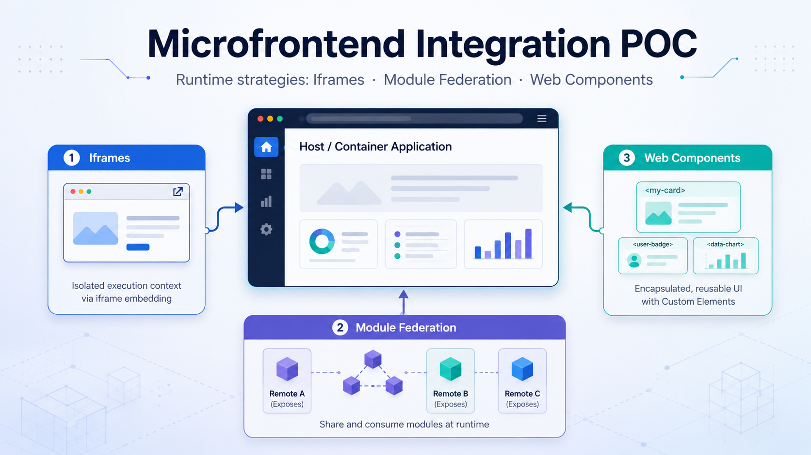

# Microfrontend Integration POC

Proof of concept comparing different strategies for integrating **independently developed frontend modules at runtime**.

The main question behind this repository was:

> How can a frontend application be split into independently developed and deployed pieces while still behaving as a single application?

This POC focuses on three runtime integration approaches:

1. **Iframes**
2. **Module Federation**
3. **Web Components**

## Context

Microfrontends apply some of the same ideas as backend microservices to the frontend: split a large application into smaller units with clearer ownership and more independent development and deployment.

A microfrontend can own:

- a fragment of a screen, such as a cart or product list
- a full screen
- a group of screens or a feature flow

The expected benefits are smaller codebases, more focused teams and more independent delivery. The trade-off is increased integration and coordination complexity.

## Scope of the POC

Microfrontend integration can happen at different stages:

- **Build time** — multiple modules are combined into one final application build
- **Runtime** — independently built modules are composed in the browser
- **Server side** — independently deployed applications are composed or routed by the server

This repository focuses specifically on **runtime integration**.

```text
                         Host / Container
                               │
            ┌──────────────────┼──────────────────┐
            │                  │                  │
            ▼                  ▼                  ▼
         Iframe        Module Federation    Web Component
            │                  │                  │
            ▼                  ▼                  ▼
      Independent         Remote module       Custom Element
       document          loaded at runtime     loaded at runtime
```

## Implementations

| Approach | Experiment |
| --- | --- |
| Iframe | [`iframe/`](./iframe/) |
| Module Federation | [`module-federation/`](./module-federation/) |
| Web Components | [`web-component/`](./web-component/) |

Each implementation explores a different balance between **isolation, integration, deployment independence and coupling**.

## What I evaluated

The POC focused on practical integration concerns:

- independent builds and deployments
- runtime loading
- communication between host and microfrontend
- dependency sharing
- framework coupling
- style / DOM isolation
- routing implications
- integration complexity

## Findings

### Iframes

Iframes provide the strongest isolation and the simplest conceptual integration because each microfrontend is a separate document.

**Strengths**

- simple to integrate
- strong runtime and style isolation
- independently hosted applications can be embedded without being known at build time

**Trade-offs**

- host ↔ iframe communication requires an explicit messaging boundary
- cross-origin communication typically uses `window.postMessage`
- layout integration can be awkward, especially dynamic height and nested scrolling
- the isolation that makes iframes simple also makes deep integration harder

### Module Federation

Module Federation provides much tighter integration between independently built applications. A host can load exposed modules from a remote build at runtime.

**Strengths**

- runtime loading of separately built modules
- components can participate naturally in the host application
- dependencies can be shared rather than duplicated
- suitable for component- or feature-level composition

**Trade-offs**

- more build/tooling configuration
- shared dependencies introduce coordination and versioning concerns
- host and remote can become coupled through framework dependencies, routing or shared state
- less isolation than an iframe

### Web Components

Web Components provide a browser-native integration contract through Custom Elements.

**Strengths**

- the host does not need the same frontend framework as the component implementation
- simple HTML-level consumption
- encapsulation can be provided through Shadow DOM
- components can be packaged and loaded independently

**Trade-offs**

- the integration API is lower-level than framework-native components
- attributes, properties and events need an explicit contract
- routing inside independently packaged components requires architectural decisions
- framework-generated Web Components still depend on the tooling/runtime used to build them

## Comparison

For the detailed trade-off matrix, see:

[Runtime integration comparison](./technical-docs/comparison.md)

For the original technical concepts explored during the POC, see:

[Microfrontend research notes](./technical-docs/microfrontend-notes.md)

## Main takeaway

There is no universally best runtime integration mechanism.

The choice depends on the type of independence the application needs:

- **Iframes** maximize isolation.
- **Module Federation** maximizes integration between independently built applications.
- **Web Components** provide a framework-neutral browser contract.

The most important architectural decision is not only how to split the frontend, but **where to place the boundary between independent teams without creating excessive coupling between the resulting applications**.

## Historical note

This POC was implemented with the Vue/Webpack tooling available at the time, including Vue CLI Web Component build targets.

The architectural comparison remains useful, but some implementation details are now legacy. Vue CLI is currently in maintenance mode, and modern Vue applications typically use Vite and `defineCustomElement()` for Vue-based Custom Elements.

The repository is kept as a record of the architectural experiment rather than as a current production template.
